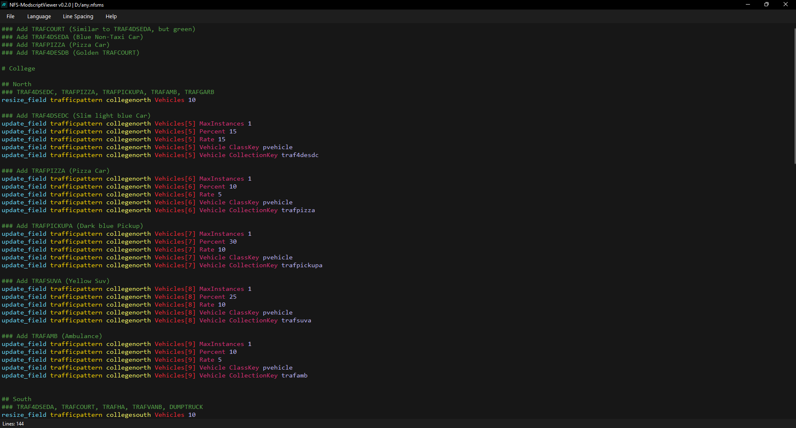
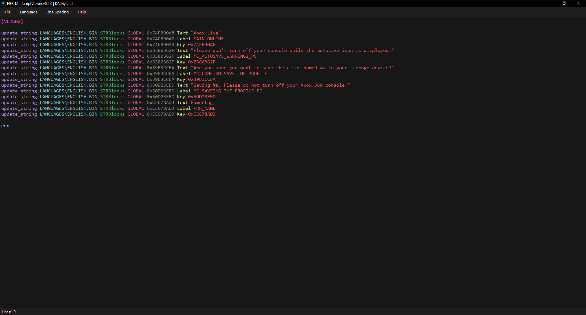

# NFS-ModscriptViewer `Beta`
A lightweight text viewer and editor for Need for Speed modscripts.

## Disclaimer
> This tool is currently in **Beta**. The core features are stable and fully operational, but some minor features—like advanced syntax highlighting rules—are still actively being worked on.

## Overview
This tool provides syntax highlighting and editing capabilities for `.nfsms` (Attribulator) and `.end` (Binary) scripts, making modscript analysis and modification easier.

## Features
* **File Management:** Open, save, and export scripts easily.
* **Custom Line Spacing:** Adjust spacing dynamically to fit your reading preferences.
* **Built-in Task Killer:** Terminate game instances (`speed.exe`, `nfsc.exe`, `NFS.exe`) directly from the menu if they get stuck.
* **Syntax Highlighting:** Visual color coding for game commands.

## Installation
Download the latest version from the [releases page](https://github.com/Kevin4e/NFS-ModscriptViewer/releases).

Every release comes in two formats:
* **Portable Version:** Standalone `.zip` (or `.7z`) archive. All dependencies are packed next to the `.exe`. Just extract and run.
* **Setup Version (Recommended):** Standard Windows installer. 

> **Why use the installer?** The installer automatically handles desktop shortcuts and configures the Windows registry to set NFS-ModscriptViewer as the default application for `.nfsms` and `.end` file extensions.

## Interfaces (v0.2.0)
### Attribulator

### Binary

## Want to Contribute?
Since the tool is in Beta, the core engine is set, but I'm always looking for mechanics to help tune it up.

I'd love help with:
- Enhancing or adding new syntax highlighting colors.
- Optimizing the text rendering or memory usage for massive scripts.
- Implementing missing quality-of-life features you want to see.

Feel free to fork the repo, experiment, and [open a Pull Request](https://github.com/Kevin4e/NFS-ModscriptViewer/pulls).

## Credits
* **[Kevin4e](https://github.com/Kevin4e)** - Author and developer.
